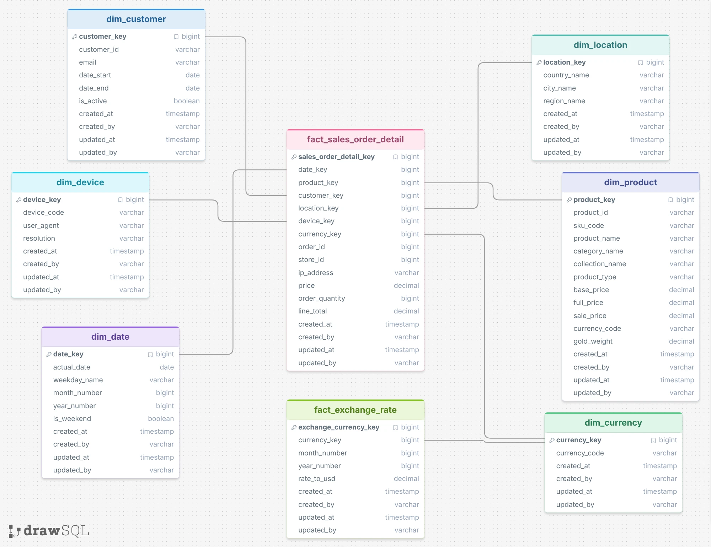
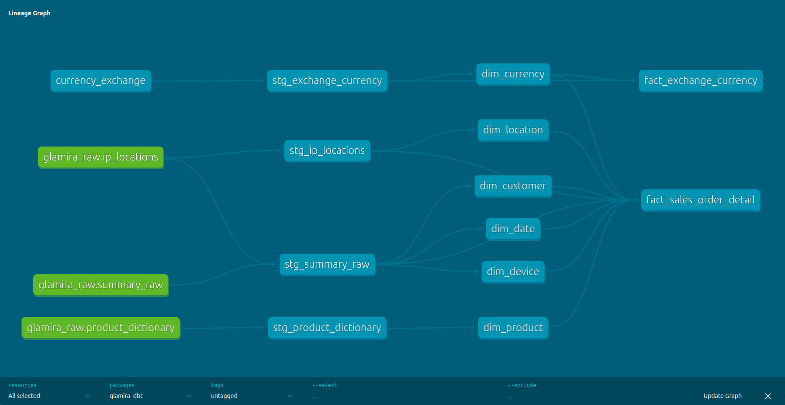
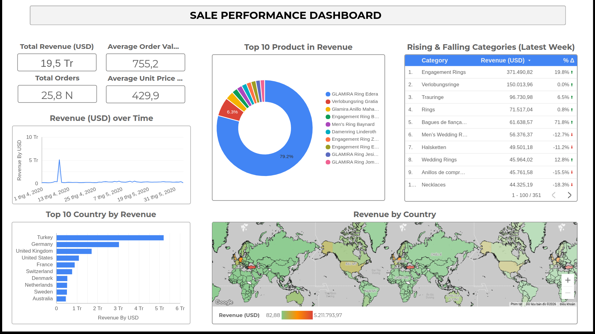

# Glamira Data Pipeline

An automated system for scraping product data, resolving IP geolocation, exporting data to Google Cloud Storage, loading it into BigQuery, transforming with dbt, masking PII with GCP DLP, and visualizing with Looker Studio.

---

## Features

- **Product Crawling:** Collects product information (price, type, SKU, etc.) based on user interaction IDs.
- **Anti-bot Handling (403/429):** Two-phase approach — Phase 1 for fast scanning, Phase 2 for slow retries using Exponential Backoff and AsyncLimiter to reliably bypass Cloudflare protection.
- **IP Geolocation:** Batch-processes IP addresses from the database and maps them to Country/City using the IP2Location library.
- **GCS Export:** Dumps MongoDB collections into partitioned `.jsonl` files and uploads them to Google Cloud Storage.
- **BigQuery Load:** A Cloud Function automatically triggers on each uploaded file, transforms the data (flatten MongoDB ObjectIds, parse price strings to float, flatten nested fields), and loads it into BigQuery — one file per load job with automatic retry on rate limits.
- **dbt Transformations:** Builds a dimensional model (star schema) on top of raw BigQuery data with incremental loading, surrogate keys, and automated data quality tests.
- **PII Masking:** Uses GCP Cloud DLP to de-identify sensitive fields (e.g. IP addresses) in raw tables before they are consumed downstream.
- **Dashboard:** Interactive business intelligence dashboard built on Looker Studio connected directly to BigQuery marts.

---

## Prerequisites

- Python 3.9 or higher
- [Poetry](https://python-poetry.org/) — dependency and virtual environment management
- MongoDB
- IP2Location binary file: `IP-COUNTRY-REGION-CITY.BIN`
- [dbt-bigquery](https://docs.getdbt.com/docs/core/connect-data-platform/bigquery-setup) 1.11+
- Google Cloud project with the following APIs enabled:
  - Cloud Functions
  - Cloud Build
  - BigQuery
  - Cloud Storage
  - Cloud Data Loss Prevention (DLP)

---

## Setup

**Step 1 — Install dependencies**

Navigate to the project root and run the following command. Poetry will automatically create a virtual environment and install all required packages:

```bash
poetry install
```

**Step 2 — Configure environment variables**

Create a `.env` file at the project root:

```
MONGO_URI=mongodb://127.0.0.1:27017/
```

And change database name (`DB_NAME`) and bucket name (`BUCKET_NAME`) with yours in `src/config.py`.

**Step 3 — Prepare the IP data file**

Place the IP2Location BIN file at the following path:

```
data/ip_geo/IP-COUNTRY-REGION-CITY.BIN
```

**Step 4 — Authenticate with Google Cloud**

```bash
gcloud auth application-default login
gcloud config set project YOUR_PROJECT_ID
```

---

## Usage

Activate the Poetry virtual environment before running any command:

```bash
poetry shell
```

Use the `--job` flag to specify which pipeline to run:

**Crawl product data:**

```bash
python src/main.py --job crawl
```

Crawl logs are saved to `logs/pipeline.log`.

**Process IP geolocation:**

```bash
python src/main.py --job geo
```

**Export MongoDB collections to GCS:**

```bash
python src/export_gcs.py
```

Exports the following collections as partitioned `.jsonl` files to `gs://{BUCKET_NAME}/exports/{collection}/`:

| Collection | GCS folder | Rows per file |
|---|---|---|
| `ip_locations` | `exports/ip_locations/` | 200,000 |
| `product_dictionary` | `exports/product_dictionary/` | 100,000 |
| `summary` | `exports/summary_raw/` | 200,000 |

**Deploy the Cloud Function and backfill all data:**

```bash
cd cloud_function
bash deploy.sh
```

This script will:
1. Enable required GCP APIs
2. Grant IAM permissions to the Cloud Function service account
3. Deploy the `gcs_to_bq_trigger` Cloud Function
4. Truncate existing BigQuery tables
5. Re-trigger all files in GCS sequentially (35s apart) to avoid BigQuery rate limits

**Run dbt transformations:**

```bash
cd glamira_dbt

# First run / full refresh
dbt run --full-refresh

# Incremental run (daily)
dbt run

# Run tests
dbt test
```

---

## Architecture

```
MongoDB
  ↓
  ↓  export_gcs.py (partitioned .jsonl, batch upload)
  ↓
GCS bucket: exports/{table}/*.jsonl
  ↓
  ↓  google.storage.object.finalize (event trigger)
  ↓
Cloud Function: gcs_to_bq_trigger
  ↓  - flatten _id.$oid → STRING
  ↓  - parse price STRING → FLOAT64
  ↓  - flatten option{} → alloy, diamond, shapediamond columns
  ↓  - 1 file = 1 BQ load job (retry on 429)
  ↓
BigQuery dataset: raw_layer
  ├── ip_locations
  ├── product_dictionary
  └── summary_raw
  ↓
  ↓  GCP Cloud DLP (PII masking)
  ↓  - ip_address → SHA-256 hash token
  ↓
BigQuery dataset: raw_layer (de-identified)
  ↓
  ↓  dbt (staging → marts)
  ↓
BigQuery dataset: staging
  ├── stg_summary_raw        (view)
  ├── stg_ip_locations       (view)
  ├── stg_product_dictionary (view)
  └── stg_exchange_currency  (view)
  ↓
BigQuery dataset: marts
  ├── dim_date
  ├── dim_product
  ├── dim_customer
  ├── dim_device
  ├── dim_location
  ├── dim_currency
  ├── fact_sales_order_detail
  └── fact_exchange_currency
  ↓
Looker Studio Dashboard
```

---

## Data Model

The marts layer follows a **star schema** design. Fact tables reference dimension tables via surrogate keys generated with `FARM_FINGERPRINT`.



### Key design decisions

- **Surrogate keys** are generated using `FARM_FINGERPRINT(CONCAT(...))` for deterministic, join-safe keys across incremental loads.
- **Incremental strategy** uses `unique_key` merge so re-runs are idempotent.
- **`COALESCE(..., -1)`** on all foreign keys ensures referential integrity — unknown dimension members resolve to a dedicated "Unknown" row.
- **`created_at` / `updated_at`** audit columns are preserved correctly across incremental runs by left-joining back to the existing table.

---

## dbt Project Structure

```
glamira_dbt/
├── models/
│   ├── staging/
│   │   ├── stg_summary_raw.sql
│   │   ├── stg_ip_locations.sql
│   │   ├── stg_product_dictionary.sql
│   │   └── stg_exchange_currency.sql
│   └── marts/
│       ├── dim_date.sql
│       ├── dim_product.sql
│       ├── dim_customer.sql
│       ├── dim_device.sql
│       ├── dim_location.sql
│       ├── dim_currency.sql
│       ├── fact_sales_order_detail.sql
│       └── fact_exchange_currency.sql
├── tests/
├── seeds/
├── dbt_project.yml
└── profiles.yml (local, not committed)
```

---

## Data Lineage
 
Data lineage is auto-generated by **dbt docs** and visualized as an interactive DAG in the browser.
 
```bash
dbt docs generate
dbt docs serve  # opens at http://localhost:8080
```
 
Navigate to **Lineage Graph** (bottom-right of any model page) to explore the full dependency graph interactively.
 

 
The graph shows three distinct data flows converging into the two fact tables:
 
| Flow | Source → Staging → Marts |
|---|---|
| **Sales orders** | `glamira_raw.summary_raw` → `stg_summary_raw` → `fact_sales_order_detail` |
| **IP geolocation** | `glamira_raw.ip_locations` → `stg_ip_locations` → `dim_location` → `fact_sales_order_detail` |
| **Products** | `glamira_raw.product_dictionary` → `stg_product_dictionary` → `dim_product` → `fact_sales_order_detail` |
| **Currency rates** | `currency_exchange` → `stg_exchange_currency` → `dim_currency` + `fact_exchange_currency` |
 
> **Green nodes** = raw source tables (`glamira_raw.*`). **Teal nodes** = dbt models (staging and marts).
 
---

## Dashboard (Looker Studio)

The dashboard is built on **Looker Studio** connected directly to the BigQuery `marts` dataset.

### Preview



### Live Link

[View Dashboard →](https://datastudio.google.com/reporting/ba3b8ad7-7f61-4fae-8181-c6d9075a3bac)

### Key metrics covered

- Total revenue and orders over time
- Revenue breakdown by product, currency, and region
- Customer distribution by country and city
- Device usage share across orders
- Exchange rate trends

---

## Project Structure

```
glamira-pipeline/
├── src/
│   ├── main.py
│   ├── config.py
│   ├── crawler/
│   └── geo/
├── cloud_function/
│   ├── main.py
│   └── deploy.sh
├── glamira_dbt/
│   ├── models/
│   ├── tests/
│   ├── seeds/
│   └── dbt_project.yml
├── data/
│   └── ip_geo/
├── docs/
│   ├── data_model.webp
│   └── dashboard_screenshot.png
├── logs/
├── pyproject.toml
└── README.md
```
